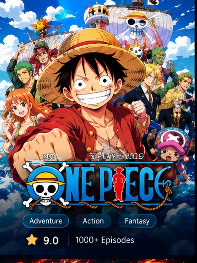
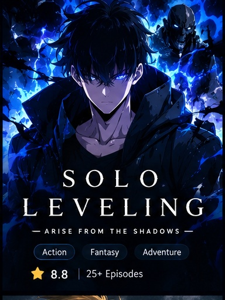
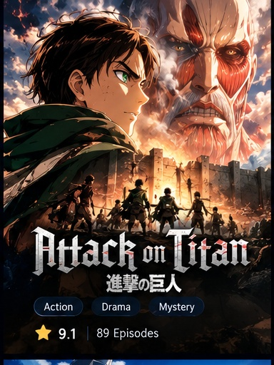
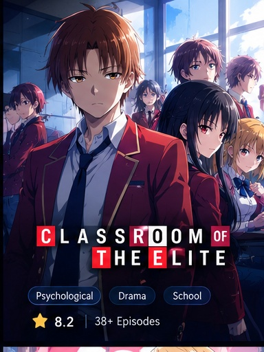

<!DOCTYPE html>
<html lang="en">
<head>
<meta charset="UTF-8">
<meta name="viewport" content="width=device-width, initial-scale=1.0">

<title>AnimeHindi123 — Anime Discovery</title>
<meta name="description" content="AnimeHindi123 — Discover trending, popular and latest anime.">

</head>

<body>

<header class="navbar">
  

    
AnimeHindi123

    <nav class="nav-links">
      <a href="#home">Home</a>
      <a href="#popular">Popular</a>
      <a href="#latest">Latest</a>
      <a href="#about">About</a>
    </nav>
  

</header>

<section class="hero" id="home">
  

    
✦ PREMIUM ANIME DISCOVERY

    <h1>Discover Your Next Anime.</h1>

    

      Explore popular, trending and latest anime titles in one beautiful
      anime discovery experience.
    

    

      <a class="btn btn-primary" href="#popular">Explore Anime</a>
      <a class="btn btn-secondary" href="#latest">Latest Releases</a>
    

  

</section>

<main class="container">

<section id="popular">

  

    <h2>🔥 Popular Anime</h2>
    
Fan-favorite anime worth watching

  

  <input id="search" type="text" placeholder="Search anime...">

  <select id="genre">
    <option value="all">All Genres</option>
    <option value="action">Action</option>
    <option value="romance">Romance</option>
    <option value="fantasy">Fantasy</option>
    <option value="adventure">Adventure</option>
    <option value="comedy">Comedy</option>
  </select>

<!-- ONE PIECE -->
<article class="card" data-title="one piece" data-genre="adventure">
  

    
    ⭐ 9.0
    One Piece
  

  

    

      Adventure
      Action
    

    
Monkey D. Luffy begins his legendary journey to become Pirate King.

    <button class="details-btn" onclick="openAnime('One Piece')">View Details</button>
  

</article>

<!-- SOLO LEVELING -->
<article class="card" data-title="solo leveling" data-genre="action">
  

    
    ⭐ 8.8
    Solo Leveling
  

  

    

      Action
      Fantasy
    

    
A weak hunter discovers a mysterious system that changes his fate.

    <button class="details-btn" onclick="openAnime('Solo Leveling')">View Details</button>
  

</article>

<!-- ATTACK ON TITAN -->
<article class="card" data-title="attack on titan" data-genre="action">
  

    
    ⭐ 9.1
    Attack on Titan
  

  

    

      Action
      Drama
    

    
Humanity fights for survival behind enormous walls.

    <button class="details-btn" onclick="openAnime('Attack on Titan')">View Details</button>
  

</article>

<!-- COTE -->
<article class="card" data-title="classroom of the elite" data-genre="action">
  

    
    ⭐ 8.4
    Classroom of the Elite
  

  

    

      Psychological
      Drama
    

    
A brilliant
